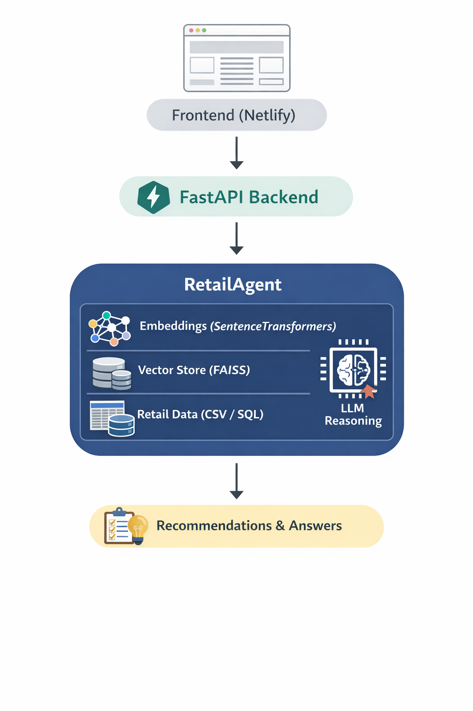

# 🛒 Retail AI Agent — End-to-End Agentic ML System

> An AI-powered recommendation engine combining semantic search, RAG pipelines, and LLM orchestration — built for production-grade retail intelligence.

[](https://python.org)
[](https://fastapi.tiangolo.com)
[](https://github.com/facebookresearch/faiss)
[](https://docker.com)
[](https://cloud.google.com)
[](LICENSE)

---

## 📌 Overview

**Retail AI Agent** enables natural language querying of retail data, combining embedding-based semantic search, vector similarity ranking, and LLM reasoning to deliver intelligent, context-aware product recommendations.

This project demonstrates production-grade ML engineering — agent-based reasoning, Retrieval Augmented Generation (RAG), FastAPI microservices, FAISS vector search, and MLOps-ready design.

**Example queries the system handles:**

| Query | Intent |
|-------|--------|
| `"Healthy dinner ideas"` | Nutritional filtering |
| `"Popular snacks"` | Trend-based ranking |
| `"Fruits under $5"` | Price + category constraint |
| `"Recommend products for kids"` | Demographic targeting |

---

## 🏗️ Architecture



---

## 🔑 Core Components

### 1. 🤖 Agentic Framework

A custom **RetailAgent** implements a full reasoning loop:

- **Query Parsing** — intent extraction and entity recognition
- **Embedding Generation** — dense vector representations via SentenceTransformers
- **Vector Similarity Search** — FAISS-powered nearest-neighbor retrieval
- **Product Ranking** — cosine similarity scoring
- **LLM Response Synthesis** — grounded answer generation

Modeled after LangChain-style agent pipelines with support for tool calling, context retrieval, and response generation.

---

### 2. 🔍 Retrieval Augmented Generation (RAG)

```
User Query
    ↓
Embedding Generation (SentenceTransformers)
    ↓
FAISS Vector Search
    ↓
Product Context Retrieval
    ↓
LLM Answer Construction
    ↓
Ranked Recommendations
```

**Benefits:**
- Reduces hallucinations with grounded context
- Fuses structured product data with unstructured queries
- Produces verifiable, traceable responses

---

### 3. 🧬 NLP + Embeddings

- Dense embeddings via **SentenceTransformers**
- **Cosine similarity** ranking across product corpus
- Semantic clustering for product groupings
- NLP preprocessing and intent filtering

---

## ⚙️ Tech Stack

### ML / NLP
| Component | Technology |
|-----------|------------|
| Embeddings | SentenceTransformers |
| Vector Index | FAISS |
| ML Utilities | Scikit-learn |
| LLM Layer | Transformers / LLM Orchestration |
| Pattern | RAG (Retrieval-Augmented Generation) |

### Backend
| Component | Technology |
|-----------|------------|
| API Framework | FastAPI |
| Server | Uvicorn / Gunicorn |
| Design | Stateless REST, CORS middleware |
| Agent Layer | Decoupled from transport |

### Data & MLOps
| Component | Technology |
|-----------|------------|
| Data Processing | Pandas, NumPy |
| Containerization | Docker |
| Orchestration | Kubernetes |
| CI/CD | Automated pipelines |
| Model Versioning | MLOps-ready design |

### ☁️ Cloud Architecture (GCP)
| Service | Purpose |
|---------|---------|
| Vertex AI | Model hosting |
| BigQuery | Analytics + training data |
| Cloud Storage | Artifacts + embeddings |
| Cloud Composer / Airflow | ML pipeline orchestration |

---

## 🔄 ML Workflow Automation

Airflow DAG integration handles the full pipeline lifecycle:

1. **Data Ingestion** — ingest and validate retail datasets
2. **Embedding Regeneration** — rebuild semantic vectors on data updates
3. **Vector Index Rebuild** — refresh FAISS index
4. **Deployment Trigger** — automated rollout on pipeline success

---

## 🧪 Testing Strategy

| Layer | Scope |
|-------|-------|
| Unit Tests | Agent logic, embedding functions |
| Integration Tests | API ↔ Agent interaction |
| End-to-End | Frontend → Backend → Response validation |

---

## 📦 Installation

```bash
# Clone repository
git clone https://github.com/yourusername/retail-ai-agent.git
cd retail-ai-agent

# Create virtual environment
python -m venv venv
source venv/bin/activate       # Linux / macOS
venv\Scripts\activate          # Windows

# Install dependencies
pip install -r requirements.txt

# Run FastAPI backend
uvicorn app.main:app --reload
```

The API will be available at `http://localhost:8000`. Interactive docs at `http://localhost:8000/docs`.

---

## 🚀 Designed to Scale

The architecture supports future horizontal scaling:

- **Batch pipelines** for offline embedding generation
- **Streaming ingestion** for real-time product updates
- **Distributed vector stores** for large-scale retrieval
- **Kubernetes** for horizontal scaling and load balancing

---

## 👤 Contributors

**Santhosh Varma**
*Software Engineer & Applied ML Developer*

Focused on Agentic AI, ML systems, and scalable backend architecture.

---

<p align="center">
  <sub>Built with ❤️ using FastAPI · FAISS · SentenceTransformers · GCP</sub>
</p>
